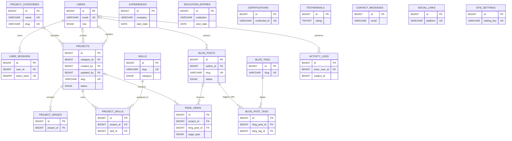

# Portfolio database design (MySQL 8.0.16+)

This is a standalone, greenfield reference design. It intentionally does not replace the repository's existing MySQL v3 migration, whose smaller schema is coupled to the current API contract.

## Assumptions

- **Administration:** one owner account is expected. `users.role` still allows `admin` and `editor` so delegated access can be added without redesigning ownership or audit history.
- **Soft deletion:** recommended for editable content, identities, messages, and settings because accidental dashboard deletion should be recoverable and old public URLs should not silently point at new content. Junction rows, sessions, raw analytics, and activity logs use hard deletion or retention policies because they are dependent or append-oriented data. Every read of a soft-deletable table must include `deleted_at IS NULL`; unique email, slug, and setting-key values deliberately remain reserved after deletion.
- **Internationalization:** not included because the site is assumed to have one editorial language. Add narrow translation tables such as `project_translations(project_id, locale, title, short_description, full_description)` and `blog_post_translations(blog_post_id, locale, ...)`, with `UNIQUE(parent_id, locale)`, rather than adding one column per language.
- **Identifiers:** all tables use `BIGINT UNSIGNED AUTO_INCREMENT`. This is compact, fast to join, simple in MySQL tooling, and appropriate for one primary application database; use UUIDv7 only if identifiers must be generated across independent writers or exposed without guessable sequences.
- **Time:** all `DATETIME` values are UTC. The application must set each connection's session time zone to `+00:00` and convert only at presentation boundaries.
- **Deployment mode:** the SQL artifacts target a newly provisioned empty database. Database/account provisioning and least-privilege grants belong outside application migrations.

## Deliverables and execution order

1. Run [`database/mysql/001_portfolio_schema.sql`](../database/mysql/001_portfolio_schema.sql) against an empty MySQL 8.0.16+ database. MySQL 8.0.16 is the minimum because earlier 8.0 releases parsed but did not enforce `CHECK` constraints.
2. Optionally run [`database/mysql/002_portfolio_demo_seed.sql`](../database/mysql/002_portfolio_demo_seed.sql) once to load demonstration content.
3. Copy or adapt the 15 prepared examples in [`database/mysql/common_queries.sql`](../database/mysql/common_queries.sql).

The demo owner is disabled. Its randomly generated password was discarded, so an application command must replace `password_hash` and set `is_active = TRUE` before dashboard login is possible.

## Entity and relationship design

`project_categories` is a lookup table rather than an enum or free-text project column because categories are editorial data that may grow, be renamed, reordered, or retired. Skill categories, roles, workflow statuses, employment types, page types, and setting value types are small fixed sets, so enums are appropriate there. `projects.view_count` and `blog_posts.view_count` are intentionally denormalized lifetime counters for fast cards and sort orders, while `page_views` retains raw events for time-window analysis and reconciliation.

The page-view target uses nullable, entity-specific foreign keys instead of the common `page_type/page_id` polymorphic pattern, so InnoDB can validate every non-null project or post reference while still supporting static paths. The application must validate that each row has exactly one matching target: `project_id`, `blog_post_id`, or `page_path`. MySQL does not permit a `CHECK` on columns that also use foreign-key referential actions, so expressing that exclusive-or rule as a check would make the DDL invalid; a deployment that requires database-only enforcement can add reviewed `BEFORE INSERT/UPDATE` triggers. `activity_logs.subject_type/subject_id` remains polymorphic by design because audit history must survive subject deletion and can describe future entity types without schema changes.

Meaningful string bounds are used rather than defaulting everything to 255: email is 254 characters; slugs are 191 ASCII characters; human names and titles are generally 60–180; SEO title and description values follow common 60/160 display targets; URLs allow 2048; user agents allow 512; summaries use 500; and unbounded prose uses `TEXT` or `MEDIUMTEXT`.

## ER diagram

The standalone `experiences`, `education_entries`, `certifications`, `testimonials`, `contact_messages`, `social_links`, and `site_settings` entities have no artificial foreign-key dependency because they describe the single portfolio owner or site itself.

## Foreign-key deletion rules

| Constraint | Rule | Reason |
|---|---|---|
| `fk_user_sessions_user` | `CASCADE` | A session has no meaning after its user is physically removed. |
| `fk_projects_category` | `RESTRICT` | Prevents hard deletion of a category that still classifies projects; retire it with soft delete instead. |
| `fk_projects_created_by` | `SET NULL` | Keeps project content if its original author is removed. |
| `fk_projects_updated_by` | `SET NULL` | Keeps project content and marks a removed last editor as unknown. |
| `fk_project_images_project` | `CASCADE` | Gallery metadata is wholly owned by its project. |
| `fk_project_skills_project` | `CASCADE` | Project removal should remove its assignments. |
| `fk_project_skills_skill` | `RESTRICT` | Prevents deleting a skill still cited by projects; retire it with soft delete. |
| `fk_blog_posts_author` | `SET NULL` | Published content survives removal of an author account. |
| `fk_blog_post_tags_post` | `CASCADE` | A post/tag relationship has no value without its post. |
| `fk_blog_post_tags_tag` | `CASCADE` | Hard tag deletion removes only its relationships, not posts. |
| `fk_page_views_project` | `CASCADE` | Hard-deleting a project removes analytics that can no longer be attributed correctly. |
| `fk_page_views_blog_post` | `CASCADE` | Hard-deleting a post removes analytics that can no longer be attributed correctly. |
| `fk_activity_logs_actor` | `SET NULL` | Audit events must remain even if the acting account is later removed. |

## Indexes

Primary keys are omitted below. Unique indexes both enforce business rules and support direct lookups; secondary and full-text indexes are ordered for the query filters shown in the query library.

| Table | Index | Query or rule optimized |
|---|---|---|
| `project_categories` | `uq_project_categories_name` | Prevents duplicate display names and supports exact name lookup. |
| `project_categories` | `uq_project_categories_slug` | Enforces permanent URL/category identity and supports slug lookup. |
| `project_categories` | `idx_project_categories_public` | Active, non-deleted navigation ordered by `sort_order`. |
| `users` | `uq_users_email` | Enforces one identity per email and handles login lookup; a second email-prefix index would be redundant. |
| `users` | `idx_users_role` | Active dashboard-user listing by role. |
| `user_sessions` | `uq_user_sessions_token_hash` | Constant-time session lookup and token-digest uniqueness. |
| `user_sessions` | `idx_user_sessions_user_active` | Finds or revokes active sessions for one user. |
| `user_sessions` | `idx_user_sessions_expiry` | Batch cleanup of expired sessions. |
| `projects` | `uq_projects_slug` | Public project detail lookup and permanent URL identity. |
| `projects` | `idx_projects_public_featured` | Published featured cards in manual display order. |
| `projects` | `idx_projects_category_public` | Category-filtered public project pagination. |
| `projects` | `idx_projects_published` | Chronological published-project feeds. |
| `projects` | `idx_projects_created_by` | Author relationship joins and FK checks. |
| `projects` | `idx_projects_updated_by` | Last-editor relationship joins and FK checks. |
| `projects` | `ft_projects_search` | Natural-language search over title, summary, and full description. |
| `project_images` | `idx_project_images_gallery` | Loads one active gallery in display order. |
| `skills` | `uq_skills_name` | Prevents duplicate human-readable skills. |
| `skills` | `uq_skills_slug` | Enforces stable skill identifiers. |
| `skills` | `idx_skills_category_order` | Renders active skills grouped and ordered by category. |
| `skills` | `idx_skills_featured` | Loads the featured-skill subset. |
| `project_skills` | `uq_project_skills_pair` | Prevents duplicate project/skill assignments. |
| `project_skills` | `idx_project_skills_project_order` | Loads a project's stack in display order. |
| `project_skills` | `idx_project_skills_skill` | Reverse lookup of projects using a skill and FK enforcement. |
| `experiences` | `idx_experiences_timeline` | Active work history in chronological/manual order. |
| `education_entries` | `idx_education_timeline` | Active education history in chronological/manual order. |
| `certifications` | `uq_certifications_credential` | Prevents a repeated non-null credential within an issuer. |
| `certifications` | `idx_certifications_display` | Active credentials ordered by issue date and display order. |
| `blog_posts` | `uq_blog_posts_slug` | Public post detail lookup and permanent URL identity. |
| `blog_posts` | `idx_blog_posts_public` | Published post pagination by date. |
| `blog_posts` | `idx_blog_posts_popular` | Most-viewed published-post lists. |
| `blog_posts` | `idx_blog_posts_author` | Admin author/status filtering and FK enforcement. |
| `blog_posts` | `ft_blog_posts_search` | Natural-language search over title, excerpt, and body. |
| `blog_tags` | `uq_blog_tags_name` | Prevents duplicate display tags. |
| `blog_tags` | `uq_blog_tags_slug` | Enforces stable tag identifiers. |
| `blog_tags` | `idx_blog_tags_name` | Alphabetical active-tag management. |
| `blog_post_tags` | `uq_blog_post_tags_pair` | Prevents duplicate tag assignments and serves post-to-tag joins. |
| `blog_post_tags` | `idx_blog_post_tags_tag` | Reverse tag-to-post lookup and FK enforcement. |
| `testimonials` | `idx_testimonials_public` | Approved/featured testimonial display order. |
| `contact_messages` | `idx_contact_messages_inbox` | Oldest-first unread inbox. |
| `contact_messages` | `idx_contact_messages_reply_queue` | Unreplied-message workflow. |
| `contact_messages` | `idx_contact_messages_sender` | Sender history and abuse investigation by email/date. |
| `social_links` | `uq_social_links_platform` | Enforces one configured link per platform. |
| `social_links` | `idx_social_links_public` | Active footer/profile links in display order. |
| `site_settings` | `uq_site_settings_key` | Exact key lookup and one value per setting. |
| `site_settings` | `idx_site_settings_public` | Bulk loading of public configuration. |
| `page_views` | `idx_page_views_project_time` | Project traffic over a time range and FK enforcement. |
| `page_views` | `idx_page_views_blog_time` | Blog traffic over a time range and FK enforcement. |
| `page_views` | `idx_page_views_path_time` | Static-page traffic over a time range. |
| `page_views` | `idx_page_views_time_type` | Retention cleanup and site-wide time-window reports. |
| `page_views` | `idx_page_views_visitor_time` | Approximate unique visitors in a time window. |
| `activity_logs` | `idx_activity_logs_actor_time` | Chronological audit history for an administrator and FK enforcement. |
| `activity_logs` | `idx_activity_logs_subject_time` | Audit history for a particular resource. |
| `activity_logs` | `idx_activity_logs_request` | Correlates an audit event with an application request. |

Indexes improve reads but add storage, buffer-pool pressure, and work to every insert/update/delete. Keep these indexes because they correspond to concrete access patterns, then use production `EXPLAIN ANALYZE`, slow-query logs, and cardinality data before adding more.

## Migration notes

- Never edit a migration already applied in any shared environment. Add a new numbered, checksummed, forward-only migration and test both a clean install and an upgrade from the oldest supported schema.
- Back up and verify recovery before production DDL. MySQL DDL can implicitly commit, and online behavior varies by exact 8.0 release, data type, index, and table size.
- For populated tables use **expand → migrate → contract**: add nullable/backward-compatible structures, deploy dual-compatible code, backfill in bounded batches, switch reads/writes, verify, and remove old structures in a later release.
- Add a non-null column safely by first adding it nullable or with a safe default, backfilling it, verifying no nulls remain, and only then enforcing `NOT NULL`.
- Build large indexes during a measured maintenance window or with an online-schema-change approach validated for the deployed MySQL version. Confirm the actual algorithm and lock behavior rather than assuming `ALTER TABLE` is non-blocking.
- Slug and email uniqueness currently reserves deleted values. If reuse becomes a requirement, decide redirect/history behavior first, then introduce an explicit slug-history model instead of weakening uniqueness casually.
- For i18n, add translation tables and locale-aware unique constraints in a forward migration; do not duplicate the entire parent entity per language.

## Security notes

- Hash passwords in the application with **Argon2id** using parameters tuned on the deployment hardware; bcrypt with a current cost (for example 12+) is an acceptable compatibility choice. Store only the resulting hash, support gradual rehash on login, and never log passwords.
- Generate session tokens with a cryptographically secure random source, send them in `Secure`, `HttpOnly`, `SameSite` cookies, and store only SHA-256 token digests. Rotate sessions after login/privilege changes and expire/revoke them server-side.
- Use prepared statements or a parameterizing query builder for every dynamic value. Allow-list identifiers such as sort columns because placeholders protect values, not SQL syntax identifiers.
- Validate contact fields by length and shape before storage, normalize email for workflow use, escape plain text on output, and sanitize rich HTML with a maintained allow-list if HTML is ever accepted. Database checks are a final integrity layer, not the primary input-validation UX.
- Rate-limit contact submissions by a privacy-preserving IP/visitor key and by email, add bot/challenge controls when abuse warrants them, use idempotency keys to prevent retry duplicates, and avoid exposing whether an email is known.
- Treat contact IPs, user agents, referrers, and messages as personal data. Limit administrator access, encrypt backups, define retention jobs, and hash or discard IPs as soon as operational needs allow.
- Keep secrets, SMTP credentials, API tokens, and database URLs out of `site_settings`; use a deployment secret manager. Give the runtime account only the required DML privileges and use a separate migration identity for DDL.
- Write `activity_logs` in the same transaction as important admin mutations where possible. Never include password hashes, tokens, session cookies, or full contact-message bodies in audit metadata.

## Performance notes

- Cache public project lists, project detail, skills, settings, and published post pages only after measurement shows database or rendering pressure. Invalidate relevant cache keys after successful admin commits; short TTLs are a safe starting point.
- Keep the denormalized `view_count` fields because cards frequently need a cheap total. Increment asynchronously or in atomic batches, retain `page_views` as the analytical source, and run periodic reconciliation to detect missed or duplicated counter updates.
- Partitioning is unnecessary at portfolio scale. If `page_views` grows into tens of millions of rows, first enforce retention and roll older events into daily aggregate tables; then evaluate range partitioning with actual purge/query benchmarks.
- Prefer keyset pagination over large offsets when projects or posts become numerous. The current composite indexes already include `id` as a stable tiebreaker for that evolution.
- Do not denormalize categories, skills, or tags merely to remove small joins. Consider a search index or precomputed read model only when measured traffic, ranking needs, or cross-field search exceeds InnoDB full-text capabilities.
- Recheck plans after material data growth. Low-cardinality boolean/status leading columns are useful here only because they are followed by deletion, order, time, or identity columns that match the complete query pattern.

## Design summary

The schema keeps authoritative content normalized while using small, deliberate enums only for truly fixed workflow values. Surrogate `BIGINT` keys make relationships and MySQL operations straightforward, while unique natural keys protect URLs, identities, and configuration. Soft deletion protects editable business content, and each foreign-key deletion rule reflects whether dependent data has meaning on its own. Lightweight event analytics coexist with cached view counters so public reads stay fast without giving up time-based analysis. Checks, bounded types, audit history, session-token hashing, and access-pattern-driven indexes make the design credible for production without turning a portfolio into an overengineered platform. Future languages, larger analytics volumes, and additional administrators can be added through forward-compatible migrations rather than a rewrite.
